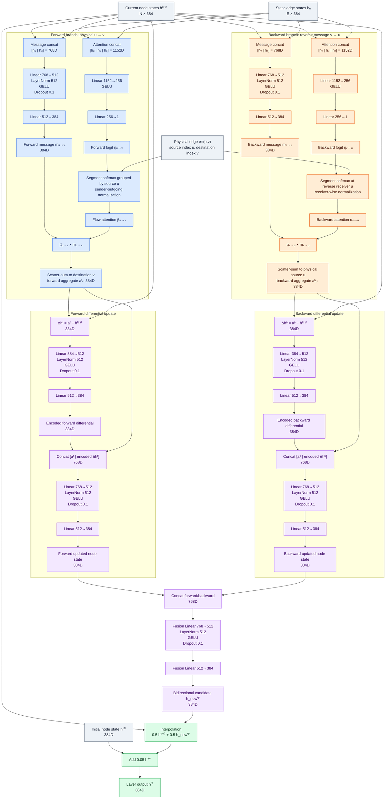
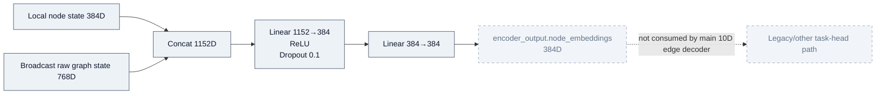
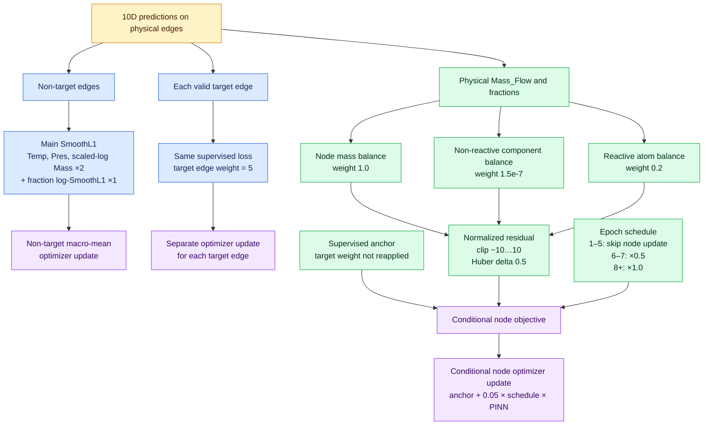

# Proposed 10D 모델 상세 아키텍처 흐름도

> 기준 config: `configs/experiment/pinn/model_260805_10d_frac1.yaml`  
> 기준 구현: `src/process_graph/models/process_encoder.py`, `src/process_graph/models/edge_decoder.py`  
> 목적: MLP, Linear, normalization, activation, dropout 및 skip path까지 포함한 현재 모델의 상세 흐름도

## 1. 전체 아키텍처

아래 Mermaid diagram은 VS Code Markdown Preview에서 바로 확인할 수 있다.

```mermaid
flowchart LR
    subgraph INPUT["A. Graph input and encoders"]
        direction TB

        OP["Operating values 18D<br/>+ validity mask 18D<br/>= 36D"]
        OPL["Linear 36→64<br/>ReLU<br/>LayerNorm 64"]
        ROLE["Node-role embedding<br/>32D"]
        UNIT["Unit-type embedding<br/>24D"]
        NCAT["Concat<br/>32 + 24 + 64 = 120D"]
        NL1["Linear 120→384<br/>ReLU<br/>Dropout 0.1"]
        NL2["Linear 384→384"]
        H0["Initial node state<br/>h⁽⁰⁾: 384D"]

        OP --> OPL --> NCAT
        ROLE --> NCAT
        UNIT --> NCAT
        NCAT --> NL1 --> NL2 --> H0

        ES["Structural edge attributes 3D<br/>× validity mask"]
        ESL["Linear 3→16<br/>ReLU<br/>LayerNorm 16"]
        ER["Stream-role embedding<br/>24D"]
        EI["Stream-ID embedding<br/>32D"]
        ECAT["Concat<br/>24 + 32 + 16 = 72D"]
        EL1["Linear 72→384<br/>ReLU<br/>Dropout 0.1"]
        EL2["Linear 384→384"]
        HE["Static edge state<br/>hₑ: 384D"]

        ES --> ESL --> ECAT
        ER --> ECAT
        EI --> ECAT
        ECAT --> EL1 --> EL2 --> HE

        FEED["Scaled CH4, AIR, WATER 3D<br/>+ availability masks 3D<br/>= 6D"]
        FL1["Linear 6→32<br/>LayerNorm 32<br/>GELU"]
        FL2["Linear 32→64<br/>LayerNorm 64<br/>GELU"]
        HF["Direct feed context<br/>h_feed: 64D"]

        FEED --> FL1 --> FL2 --> HF
    end

    subgraph GNN["B. Relational Bidirectional FlowGNN layer × 5"]
        direction TB
        LAYER["Detailed single-layer expansion<br/>shown in Section 2"]
        RES["Layer interpolation<br/>h̄⁽ˡ⁾ = 0.5 h⁽ˡ⁻¹⁾ + 0.5 h_new⁽ˡ⁾"]
        INIT["Initial-state reinjection<br/>h⁽ˡ⁾ = h̄⁽ˡ⁾ + 0.05 h⁽⁰⁾"]
        HL["Final local node states<br/>h⁽ᴸ⁾: 384D, L=5"]

        LAYER --> RES --> INIT --> HL
        INIT -. "repeat next layer" .-> LAYER
    end

    H0 --> LAYER
    HE --> LAYER
    H0 -. "0.05 skip to every layer" .-> INIT

    subgraph CONTEXT["C. Global and edge-specific conditioning"]
        direction TB

        S2S1["Set2Set, 3 recurrent steps<br/>LSTM query 384D<br/>attention-weighted readout 384D"]
        GRAW["Raw graph state<br/>[query | readout] = 768D"]
        GPL["Global Linear projection<br/>768→384"]
        HG["Projected graph context<br/>h_G: 384D"]

        HXP["Paired HX edge state 384D<br/>+ current edge state 384D<br/>+ side embedding 16D<br/>= 784D"]
        HXL1["Linear 784→256<br/>LayerNorm 256<br/>GELU<br/>Dropout 0.1"]
        HXL2["Linear 256→384"]
        HXG["sigmoid scalar gate<br/>initial value 0.05"]
        HXR["current edge + gate × delta<br/>LayerNorm 384"]
        HHX["HX-aware edge state<br/>384D"]

        S2S1 --> GRAW --> GPL --> HG
        HXP --> HXL1 --> HXL2 --> HXR --> HHX
        HXG --> HXR

        SRC["Source local node<br/>hᵤ⁽ᴸ⁾: 384D"]
        DST["Destination local node<br/>hᵥ⁽ᴸ⁾: 384D"]
        DCAT["Prediction-edge concat<br/>source 384 + destination 384<br/>+ global 384 + edge/HX 384<br/>+ direct feed 64<br/>= 1600D"]
        DESC["Edge descriptor dₑ<br/>1600D"]

        SRC --> DCAT
        DST --> DCAT
        HG --> DCAT
        HHX --> DCAT
        DCAT --> DESC
    end

    HL --> S2S1
    HL --> SRC
    HL --> DST
    HE --> HXP
    HF --> DCAT

    subgraph DECODER["D. Shared decoder and property heads"]
        direction TB

        SD1["Linear 1600→768<br/>LayerNorm 768<br/>GELU<br/>Dropout 0.1"]
        SD2["Linear 768→384<br/>LayerNorm 384<br/>GELU<br/>Dropout 0.1"]
        SDN["Final LayerNorm 384"]
        Z["Shared edge latent zₑ<br/>384D"]

        CH1["Condition Linear 384→96<br/>LayerNorm 96<br/>GELU<br/>Dropout 0.1"]
        CH2["Condition Linear 96→2"]
        COND["Temp, Pres"]

        FR1["Fraction Linear 384→128<br/>LayerNorm 128<br/>GELU<br/>Dropout 0.1"]
        FR2["Fraction Linear 128→7"]
        SM["Softmax temperature 0.5<br/>xₖ ≥ 0, Σxₖ = 1"]
        FRAC["H2O, H2, CH4, CO2,<br/>CO, O2, N2"]

        MH1["Mass Linear 384→96<br/>LayerNorm 96<br/>GELU<br/>Dropout 0.1"]
        MH2["Mass Linear 96→1"]
        INV["Inverse scaled-log<br/>max(exp(z/2) − 1e−8, 0)"]
        MASS["Mass_Flow"]

        OUT["Final physical prediction<br/>10D per predictable material edge"]

        DESC --> SD1 --> SD2 --> SDN --> Z
        Z --> CH1 --> CH2 --> COND --> OUT
        Z --> FR1 --> FR2 --> SM --> FRAC --> OUT
        Z --> MH1 --> MH2 --> INV --> MASS --> OUT
    end

    classDef input fill:#edf2f7,stroke:#4a5568,color:#1a202c;
    classDef forward fill:#dbeafe,stroke:#2563eb,color:#172554;
    classDef backward fill:#ffedd5,stroke:#ea580c,color:#431407;
    classDef diff fill:#f3e8ff,stroke:#9333ea,color:#3b0764;
    classDef skip fill:#dcfce7,stroke:#16a34a,color:#052e16;
    classDef context fill:#ccfbf1,stroke:#0f766e,color:#042f2e;
    classDef decoder fill:#e0e7ff,stroke:#4338ca,color:#1e1b4b;
    classDef output fill:#fef3c7,stroke:#d97706,color:#451a03;

    class OP,OPL,ROLE,UNIT,NCAT,NL1,NL2,H0,ES,ESL,ER,EI,ECAT,EL1,EL2,HE,FEED,FL1,FL2,HF input;
    class LAYER forward;
    class RES,INIT,HL skip;
    class S2S1,GRAW,GPL,HG,HXP,HXL1,HXL2,HXG,HXR,HHX,SRC,DST,DCAT,DESC context;
    class SD1,SD2,SDN,Z,CH1,CH2,FR1,FR2,MH1,MH2 decoder;
    class COND,SM,FRAC,INV,MASS,OUT output;
```



### 전체 그림 해석

- Main 10D head는 `edge_is_predictable=true`인 physical material edge만 decode한다.
- Virtual/context-only edge는 GNN message passing에는 참여하지만 prediction, loss 및 metric에서는 제외한다.
- Static edge state 384D는 5개 FlowGNN layer에서 반복 사용하며 layer 내부에서 갱신하지 않는다.
- Direct FeedHead 64D는 GNN을 우회해 prediction-edge descriptor에 직접 들어간다.
- Source node와 destination node state가 모두 descriptor에 직접 포함된다.

---

## 2. FlowGNN 단일 레이어 상세 확대도

아래 block이 독립 parameter를 가진 채 5회 반복된다.



### Attention normalization 식

Forward branch에서는 physical sender $u$의 outgoing edge들이 경쟁한다.

$$
\beta_{u\to v}
=
\frac{\exp(\eta_{u\to v})}
{\sum_{w\in\mathcal N_{\mathrm{out}}(u)}\exp(\eta_{u\to w})},
\qquad
\sum_{v\in\mathcal N_{\mathrm{out}}(u)}\beta_{u\to v}=1.
$$

Backward branch에서는 reverse message를 받는 $u$에서 standard receiver-wise attention을 수행한다.

$$
\alpha_{v\to u}
=
\frac{\exp(\eta_{v\to u})}
{\sum_{w\in\mathcal N_{\mathrm{out}}(u)}\exp(\eta_{w\to u})},
\qquad
\sum_{v\in\mathcal N_{\mathrm{out}}(u)}\alpha_{v\to u}=1.
$$

---

## 3. Encoder에서 계산되지만 메인 10D head가 사용하지 않는 경로

현재 config는 `use_final_projection=true`이므로 graph encoder가 다음 node embedding을 추가로 계산한다.



메인 `hierarchical_reduced_pi` edge decoder는 다음을 사용한다.

- `encoder_output.local_node_embeddings`: source/destination 384D
- `encoder_output.global_embedding`: Set2Set raw 768D, 이후 Linear 768→384
- `encoder_output.edge_embeddings`: static edge 384D

따라서 논문 메인 그림에서는 위 final node projection을 회색 점선 inset으로 두거나 생략할 수 있다.
하지만 “실제로 forward에서 계산되는 모든 Linear”를 표시하려면 위와 같이 별도로 표시해야 한다.

---

## 4. 학습 단계 연결도

학습 update는 하나의 total loss를 한 번 backward하는 구조가 아니다.



---

## 5. Linear/MLP 전체 목록

| 위치 | 정확한 layer sequence | 반복 |
|---|---|---:|
| Operating encoder | Linear 36→64 → ReLU → LN | 1 |
| Node input MLP | Linear 120→384 → ReLU → Dropout 0.1 → Linear 384→384 | 1 |
| Structural edge encoder | Linear 3→16 → ReLU → LN | 1 |
| Edge input MLP | Linear 72→384 → ReLU → Dropout 0.1 → Linear 384→384 | 1 |
| Forward message MLP | Linear 768→512 → LN → GELU → Dropout 0.1 → Linear 512→384 | 5 |
| Backward message MLP | Linear 768→512 → LN → GELU → Dropout 0.1 → Linear 512→384 | 5 |
| Forward attention MLP | Linear 1152→256 → GELU → Linear 256→1 | 5 |
| Backward attention MLP | Linear 1152→256 → GELU → Linear 256→1 | 5 |
| Forward differential encoder | Linear 384→512 → LN → GELU → Dropout 0.1 → Linear 512→384 | 5 |
| Backward differential encoder | Linear 384→512 → LN → GELU → Dropout 0.1 → Linear 512→384 | 5 |
| Forward update MLP | Linear 768→512 → LN → GELU → Dropout 0.1 → Linear 512→384 | 5 |
| Backward update MLP | Linear 768→512 → LN → GELU → Dropout 0.1 → Linear 512→384 | 5 |
| Bidirectional fusion MLP | Linear 768→512 → LN → GELU → Dropout 0.1 → Linear 512→384 | 5 |
| Encoder final node projection | Linear 1152→384 → ReLU → Dropout 0.1 → Linear 384→384 | 1, main 10D head 미사용 |
| Set2Set global projection | Linear 768→384 | 1 |
| HX relation MLP | Linear 784→256 → LN → GELU → Dropout 0.1 → Linear 256→384 | 1 |
| Direct FeedHead | Linear 6→32 → LN → GELU → Linear 32→64 → LN → GELU | 1 |
| Shared decoder stage 1 | Linear 1600→768 → LN → GELU → Dropout 0.1 | 1 |
| Shared decoder stage 2 | Linear 768→384 → LN → GELU → Dropout 0.1 → final LN | 1 |
| Condition head | Linear 384→96 → LN → GELU → Dropout 0.1 → Linear 96→2 | 1 |
| Fraction head | Linear 384→128 → LN → GELU → Dropout 0.1 → Linear 128→7 | 1 |
| Mass head | Linear 384→96 → LN → GELU → Dropout 0.1 → Linear 96→1 | 1 |

Set2Set 내부에는 3-step LSTM query와 node attention readout이 존재한다. 이는 단순 MLP가 아니므로
별도 recurrent pooling block으로 표시한다.

---

## 6. 최종 출력과 비활성 branch

최종 출력 순서:

```text
Temp, Pres,
Frac_H2O, Frac_H2, Frac_CH4, Frac_CO2, Frac_CO, Frac_O2, Frac_N2,
Mass_Flow
```

다음 항목은 현재 main prediction flow에 없으므로 활성 branch로 그리지 않는다.

- Mole_Flow head
- Vol_Flow head
- Density head
- Enthalpy head
- Energy PINN
- Decoder residual
- Edge-state update inside FlowGNN
- Target hidden adapter
- Property-stream-role branch
- CLR fraction branch
- Separate fraction-closure loss

현재 전체 학습 가능 parameter 수는 **26,704,101개**다.
