# Proposed 10D 모델 아키텍처 그림 제작 명세

> 기준 config: `configs/experiment/pinn/model_260805_10d_frac1.yaml`  
> 상세 수식 기준: `docs/model_final_0824.md`  
> 목적: 논문, 발표자료, draw.io, PowerPoint 또는 Illustrator에서 현재 모델 구조를 정확히 그리기 위한 제작용 정보

실제 MLP/Linear까지 펼친 Mermaid 흐름도는
`docs/MODEL_ARCHITECTURE_DETAILED_FLOWCHART_0826.md`를 사용한다.

## 1. 권장 그림 범위

메인 아키텍처 그림은 다음 네 영역을 왼쪽에서 오른쪽으로 배치하는 것이 가장 명확하다.

```text
[A. Graph inputs]
        ↓
[B. 5× Relational Bidirectional FlowGNN]
        ↓
[C. Global/HX/Feed edge conditioning]
        ↓
[D. Shared decoder and 10D property heads]
```

학습 loss는 forward architecture와 섞지 말고 아래쪽의 별도 점선 영역으로 연결한다.

```text
[10D predictions]
      ├── supervised edge updates
      └── conditional node PINN update
```

Sampling, early stopping 및 성능 집계는 모델 내부 구조가 아니다. 한 장에 반드시 포함해야 한다면
오른쪽 아래에 작은 `Training protocol` inset으로 배치하고, 메인 forward 화살표와 다른 점선 색을 사용한다.

---

## 2. 한 장짜리 전체 레이아웃

권장 canvas는 가로형 16:9 또는 논문 2-column 폭이다.

| 위치 | 패널 | 핵심 내용 |
|---|---|---|
| 왼쪽 | A. Input encoding | Node, edge, known-feed 입력 |
| 중앙 | B. FlowGNN block | Forward Flow Attention, backward attention, differential encoding, fusion, skip connection |
| 중앙 오른쪽 | C. Edge conditioning | Set2Set, HX pair correction, direct FeedHead, source/destination 결합 |
| 오른쪽 | D. Prediction | Shared decoder와 condition/fraction/mass heads |
| 아래쪽 | E. Training only | 분리된 supervised update와 조건부 node PINN update |

가장 중요한 시각적 강조점은 다음 세 가지다.

1. Forward는 실제 stream 방향을 유지하면서 **sender의 outgoing edge끼리 softmax**한다.
2. Backward는 physical edge를 반대로 읽고 **reverse-message receiver 기준으로 softmax**한다.
3. 최종 edge descriptor에는 **source node와 destination node가 모두 직접 들어간다.**

---

## 3. 패널 A: 입력 인코딩

### 3.1 Directed process graph

입력 graph는 다음처럼 표시한다.

```text
Unit node u  ── material stream e=(u,v) ──▶  Unit node v
```

- Node: unit operation
- Directed edge: material stream
- Physical prediction edge: `edge_is_predictable=true`
- Virtual/context-only edge: message passing에는 사용 가능하지만 property loss와 metric에서는 제외

그림에서는 physical stream을 실선, virtual/context edge를 가는 점선으로 구분하는 것이 좋다.

### 3.2 Node encoder box

Node encoder 안에는 다음 차원을 그대로 표기한다.

```text
Operating values 18D + masks 18D
                  ↓
             36 → 64D

Node role 32D + unit type 24D + operating 64D
                  ↓ concat
                 120D
                  ↓
          120 → 384 → 384D
                  ↓
             initial h_v^(0)
```

추가 annotation:

- CH4/AIR/WATER scaled feed와 mask는 `V_INPUT` node에 주입
- `log(AIR/CH4)`와 `log(WATER/CH4)`는 `V_INPUT`, `BURNER`에 주입
- Raw process-ID embedding은 사용하지 않음

### 3.3 Edge encoder box

```text
Stream role 24D
+ stream ID 32D
+ structural encoding 16D
          ↓ concat
             72D
          ↓
     72 → 384 → 384D
          ↓
 static edge state h_e
```

`h_e` 옆에는 `reused in all 5 layers; not updated inside GNN`이라고 작게 표시한다.

### 3.4 Direct FeedHead box

Node encoder와 별도의 우회 경로로 그린다.

```text
CH4, AIR, WATER scaled values 3D
+ availability masks 3D
             ↓
             6D
             ↓
        6 → 32 → 64D
             ↓
     direct feed context h_feed
```

이 경로는 GNN을 통과하지 않고 최종 edge descriptor에 직접 연결한다.

---

## 4. 패널 B: 5× Relational Bidirectional FlowGNN

하나의 layer를 큰 박스로 그린 뒤 바깥에 `×5 layers` 반복 bracket을 표시한다.
Forward와 backward는 위아래 두 lane으로 나누고 parameter를 공유하지 않는다고 명시한다.

### 4.1 Forward lane: sender-normalized Flow Attention

물리적 stream 방향은 그대로 $u\rightarrow v$다.

```text
h_u^(l-1) + h_e
        ↓
Forward message MLP
768 → 512 → 384
        ↓
m_(u→v)
```

Attention logit은 source, destination, edge를 모두 사용한다.

```text
h_u^(l-1) + h_v^(l-1) + h_e
                ↓
        Attention MLP
        1152 → 256 → 1
                ↓
             eta_(u→v)
```

그림에 넣을 핵심 식은 다음 하나면 충분하다.

$$
\beta_{u\to v}
=
\frac{\exp(\eta_{u\to v})}
{\sum_{w\in\mathcal N_{\mathrm{out}}(u)}\exp(\eta_{u\to w})},
\qquad
\sum_{v\in\mathcal N_{\mathrm{out}}(u)}\beta_{u\to v}=1.
$$

권장 label:

```text
Forward Flow Attention
physical direction u → v
softmax over sender u's outgoing edges
```

작은 분기 예시는 다음처럼 배치할 수 있다.

```text
                 ┌──▶ v1   beta_1
sender u ────────├──▶ v2   beta_2     beta_1 + beta_2 + beta_3 = 1
                 └──▶ v3   beta_3
```

주의: message passing 방향을 뒤집는 것이 아니라 **softmax normalization 기준만 sender로 바꾼 것**이다.

### 4.2 Backward lane: receiver-normalized reverse attention

같은 physical edge $e=(u,v)$를 반대로 읽어 $v\rightarrow u$ message를 만든다.

```text
h_v^(l-1) + h_e
        ↓
Backward message MLP
768 → 512 → 384
        ↓
m_(v→u)
```

$$
\alpha_{v\to u}
=
\frac{\exp(\eta_{v\to u})}
{\sum_{w\in\mathcal N_{\mathrm{out}}(u)}\exp(\eta_{w\to u})},
\qquad
\sum_{v\in\mathcal N_{\mathrm{out}}(u)}\alpha_{v\to u}=1.
$$

권장 label:

```text
Backward Attention
reverse message direction v → u
receiver-wise softmax at u
```

코드에서는 forward/backward 모두 original source index로 group하지만 의미는 다르다.

- Forward: original source $u$가 outgoing destination들에 message를 분배
- Backward: reverse graph receiver $u$가 downstream node들의 정보를 선택

### 4.3 Directional differential encoding

각 lane의 aggregate 뒤에 동일한 형태의 differential block을 두되, forward/backward parameter는
분리해서 표시한다.

$$
\Delta\mathbf h_v^{(\ell,q)}
=
\bar{\mathbf m}_v^{(\ell,q)}-\mathbf h_v^{(\ell-1)},
\qquad q\in\{\rightarrow,\leftarrow\}.
$$

```text
aggregate 384D ───────────────┐
                              ├─ concat 768D ─▶ Update MLP ─▶ 384D
aggregate - current state     │                  768→512→384
          ↓                   │
Differential encoder          │
384 → 512 → 384D ─────────────┘
```

그림 label은 `Directional Differential Encoding`으로 통일한다.

### 4.4 Bidirectional fusion

```text
Forward updated state 384D ──┐
                             ├─ concat 768D ─▶ Fusion MLP 768→512→384
Backward updated state 384D ─┘
```

### 4.5 Skip connections

Fusion 출력 뒤에 두 개의 skip arrow를 명확히 그린다.

$$
\bar{\mathbf h}^{(\ell)}
=0.5\mathbf h^{(\ell-1)}+0.5\widetilde{\mathbf h}^{(\ell)},
$$

$$
\mathbf h^{(\ell)}
=\bar{\mathbf h}^{(\ell)}+0.05\mathbf h^{(0)}.
$$

- 굵은 짧은 skip: previous-layer interpolation, coefficient 0.5
- 긴 skip: initial-state reinjection, coefficient 0.05
- Residual 뒤 별도 LayerNorm 없음

---

## 5. 패널 C: graph와 edge-specific context

### 5.1 Set2Set global path

최종 local node states에서 별도 위쪽 branch를 만든다.

```text
All final node states {h_v^(L)}, each 384D
                  ↓
          Set2Set, 3 steps
                  ↓
          raw graph state 768D
                  ↓
       global projection 768→384
                  ↓
          graph context h_G 384D
```

Raw Set2Set output을 바로 384D라고 표시하면 안 된다. 768D raw state와 384D projected state를
서로 다른 박스로 그린다.

### 5.2 HX pair correction path

Static edge state에서 별도 branch를 만든다.

```text
current edge 384D
+ paired HX edge 384D
+ hot/cold side embedding 16D
              ↓ concat 784D
        Relation MLP 784→256→384
              ↓ × sigmoid gate
       residual add + LayerNorm
              ↓
      HX-aware edge state 384D
```

Gate 초기값은 0.05다. 검증된 paired HX edge에만 적용하고, pair가 없는 edge는 원래 384D edge
state를 그대로 보낸다. 이 correction은 FlowGNN 내부가 아니라 최종 edge descriptor 직전에 적용된다.

### 5.3 Final edge descriptor

다섯 입력 화살표가 하나의 concat box로 모이게 그린다.

| Descriptor component | Dimension |
|---|---:|
| Source node state $\mathbf h_u^{(L)}$ | 384 |
| Destination node state $\mathbf h_v^{(L)}$ | 384 |
| Projected graph context $\mathbf h_{\mathcal G}$ | 384 |
| HX-aware static edge state $\bar{\mathbf h}_e$ | 384 |
| Direct feed context $\mathbf h_{\mathrm{feed}}$ | 64 |
| **Concatenated descriptor $\mathbf d_e$** | **1600** |

박스 안의 권장 표기는 다음과 같다.

```text
Edge descriptor
[source | destination | global | edge/HX | feed]
384 + 384 + 384 + 384 + 64 = 1600D
```

Source뿐 아니라 destination embedding도 최종 예측에 직접 사용한다는 점을 시각적으로 반드시 드러낸다.

---

## 6. 패널 D: shared decoder와 10D output

### 6.1 Shared decoder

```text
Edge descriptor 1600D
        ↓
Linear 1600→768 + LayerNorm + GELU + Dropout(0.1)
        ↓
Linear 768→384 + LayerNorm + GELU + Dropout(0.1)
        ↓
Shared edge latent z_e: 384D
```

Decoder residual은 비활성이다. 모든 공정과 prediction edge가 같은 decoder를 공유한다.

### 6.2 Three output heads

Shared latent에서 세 갈래로 분기한다.

```text
                         ┌─ Condition head 384→96→2 ─▶ Temp, Pres
Shared latent 384D ──────┼─ Fraction head  384→128→7 ─▶ 7 mole fractions
                         └─ Mass head      384→96→1 ─▶ scaled-log Mass_Flow
```

Fraction branch 옆에는 다음 constraint를 표시한다.

```text
Softmax temperature = 0.5
x_k ≥ 0,  Σ_k x_k = 1
```

Mass branch에는 다음을 짧게 표시한다.

$$
\widetilde m=2\log(\max(m,0)+10^{-8}),
\qquad
\hat m=\max\{\exp(\hat{\widetilde m}/2)-10^{-8},0\}.
$$

최종 10D 출력 순서는 다음과 같다.

```text
Temp, Pres,
Frac_H2O, Frac_H2, Frac_CH4, Frac_CO2, Frac_CO, Frac_O2, Frac_N2,
Mass_Flow
```

`Mole_Flow`, `Vol_Flow`, `Density`, `Enthalpy` branch는 그리지 않는다.

---

## 7. 패널 E: 학습 연결선

이 패널은 forward graph와 구분하기 위해 점선 테두리와 점선 화살표를 사용한다.

### 7.1 Supervised edge updates

10D prediction에서 다음 두 경로를 분리한다.

```text
Non-target prediction edges
       ↓
Macro-mean supervised update

Each valid target edge
       ↓
Separate supervised update, edge weight = 5
```

Supervised loss의 핵심 label:

```text
Temp, Pres: physical/training-coordinate SmoothL1
7 fractions: log-clamped SmoothL1, weight 1
Mass_Flow: scaled-log SmoothL1, weight 2
```

Fraction loss에는 다음 mask를 표시할 수 있다.

```text
true Mass_Flow > 1e-8
true fraction sum > 1e-6
```

### 7.2 Conditional node PINN update

Physical predictions에서 internal node balance로 화살표를 내린다.

```text
Mass balance       weight 1.0
Component balance  weight 1.5e-7, non-reactive nodes
Atom balance       weight 0.2, reactive nodes
                       ↓
normalized residual → clip [-10,10] → Huber delta 0.5
                       ↓
supervised anchor + 0.05 × schedule × PINN
```

Schedule:

```text
epochs 1–5 : node update skipped
epochs 6–7 : PINN multiplier 0.5
epochs 8+  : PINN multiplier 1.0
```

중요: supervised loss와 PINN loss를 하나의 global scalar로 합쳐 한 번 backward한다고 그리면 안 된다.
실제 update 순서는 다음과 같다.

```text
1. non-target supervised update
2. per-target-edge supervised updates
3. conditional anchor + PINN node update
```

---

## 8. Optional inset: validation metric

Architecture 본체 밖의 작은 inset으로만 표현한다.

```text
All official target-edge samples
          ↓ pool separately by property
10 pooled R² values
          ↓ finite arithmetic mean
target_edge_property_mean_r2
          ↓ maximize on validation
best.pt
```

10개 property:

```text
Temp, Pres, Frac_H2O, Frac_H2, Frac_CH4,
Frac_CO2, Frac_CO, Frac_O2, Frac_N2, Mass_Flow
```

- Fraction R²: true `Mass_Flow > 1e-8` 표본만 사용
- 표본 2개 이상이고 SST $\le10^{-12}$인 Proposed property R²: 0.999
- 표본 2개 미만: NaN이며 평균에서 제외
- 공식 checkpoint monitor: `val_target_edge_property_mean_r2`, maximize

이 지표는 strict target-row metric인 `target_mean_r2`와 다른 metric family다.

---

## 9. Mermaid 구조 초안

아래 코드는 최종 디자인의 배치 골격으로 사용할 수 있다. 세부 수식은 최종 그림에서 각 FlowGNN
layer inset 또는 figure caption으로 옮기는 것이 좋다.

```mermaid
flowchart LR
    subgraph A[Input encoding]
        NV[Operating 18D + mask 18D] --> NE[Node encoder<br/>36→64; 120→384→384]
        NR[Role 32D + unit 24D] --> NE
        ER[Stream role 24D + ID 32D<br/>structural 3→16] --> EE[Edge encoder<br/>72→384→384]
        FD[Feed values 3D + masks 3D] --> FH[Direct FeedHead<br/>6→32→64]
    end

    subgraph B[Relational Bidirectional FlowGNN ×5]
        NE --> FF[Forward Flow Attention<br/>u→v; sender-outgoing softmax]
        EE --> FF
        NE --> BF[Backward Attention<br/>v→u; reverse receiver softmax]
        EE --> BF
        FF --> DF[Forward differential update]
        BF --> DB[Backward differential update]
        DF --> FU[Fusion<br/>768→512→384]
        DB --> FU
        FU --> RS[Residual 0.5<br/>+ h0 reinjection 0.05]
    end

    subgraph C[Graph and edge conditioning]
        RS --> LN[Final local node states<br/>384D]
        LN --> S2S[Set2Set ×3<br/>raw 768D]
        S2S --> GP[Global projection<br/>768→384]
        EE --> HX[HX pair correction<br/>784→256→384; gate 0.05]
        LN --> ED[Edge descriptor<br/>src 384 + dst 384 + global 384<br/>+ edge 384 + feed 64 = 1600D]
        GP --> ED
        HX --> ED
        FH --> ED
    end

    subgraph D[Shared decoder and property heads]
        ED --> SD[Shared decoder<br/>1600→768→384]
        SD --> CH[Condition head<br/>384→96→2]
        SD --> FR[Fraction head<br/>384→128→7; softmax T=0.5]
        SD --> MH[Mass head<br/>384→96→1; scaled-log]
        CH --> OUT[Predictable physical edges<br/>10D output]
        FR --> OUT
        MH --> OUT
    end

    OUT -.-> SUP[Separated supervised updates]
    OUT -.-> PINN[Conditional mass/component/atom PINN update]
```



---

## 10. 권장 색상과 시각 문법

| 의미 | 권장 색상 | 선 형태 |
|---|---|---|
| Input/encoding | 회색 또는 청회색 | 실선 |
| Forward physical-flow branch | 파랑 | 굵은 실선 화살표 |
| Backward information branch | 주황 | 굵은 역방향 화살표 |
| Differential block | 보라 | 실선 |
| Residual/skip | 초록 | 곡선 또는 우회 실선 |
| Global Set2Set | 청록 | 실선 |
| HX correction | 붉은 자주색 | 실선 |
| Direct feed bypass | 짙은 초록 | 긴 우회 화살표 |
| Prediction heads | 남색 | 실선 |
| Loss/metric 연결 | 검정 또는 회색 | 점선 |

Forward와 backward 화살표는 색뿐 아니라 화살표 방향과 label로도 구분해야 흑백 출력에서 의미가
유지된다.

---

## 11. 그림에서 제외하거나 비활성으로 표시할 항목

다음 항목은 현재 main forward/backprop에 없으므로 활성 block으로 그리지 않는다.

- Process-ID embedding
- Edge embedding update inside FlowGNN
- Decoder residual
- Target hidden adapter
- Property stream role branch
- Vol_Flow/Mole_Flow/Density/Enthalpy prediction heads
- Energy PINN
- Physical-space Mass auxiliary loss
- CLR fraction loss
- Separate fraction closure loss

필요하면 figure caption 끝에 `Inactive branches are omitted`라고만 적는다.

---

## 12. 최종 그림 검수 체크리스트

- [ ] Forward arrow가 physical stream 방향 $u\rightarrow v$인가?
- [ ] Forward softmax가 sender $u$의 outgoing edge 기준이라고 적혀 있는가?
- [ ] Backward arrow가 $v\rightarrow u$이며 reverse receiver-wise attention으로 표시되었는가?
- [ ] Forward/backward parameter가 분리되어 있는가?
- [ ] Differential encoder가 양쪽 branch 모두에 있는가?
- [ ] FlowGNN 반복 횟수가 5로 표시되었는가?
- [ ] Residual 0.5와 initial reinjection 0.05가 모두 있는가?
- [ ] Set2Set raw 768D와 projected global 384D가 분리되어 있는가?
- [ ] HX correction이 GNN 내부가 아니라 descriptor 직전에 있는가?
- [ ] Direct FeedHead 64D가 GNN을 우회하는가?
- [ ] Descriptor에 source와 destination state가 모두 들어가는가?
- [ ] Descriptor 합계가 1600D인가?
- [ ] Decoder가 1600→768→384인가?
- [ ] 출력이 Temp, Pres, 7 fractions, Mass_Flow의 10D인가?
- [ ] Virtual/context-only edge가 property supervision/metric에서 제외된다고 표시했는가?
- [ ] Supervised update와 PINN update를 하나의 backward로 잘못 합치지 않았는가?
- [ ] 비활성 출력과 loss branch가 그림에서 제거되었는가?

---

## 13. 논문 figure caption 초안

> **Architecture of the proposed 10-dimensional chemical-process surrogate.** Node operating
> conditions, semantic roles, unit types, and static stream-edge attributes are encoded into
> 384-dimensional states. Five relational bidirectional FlowGNN layers propagate information in
> the physical forward direction using sender-normalized outgoing attention and in the reverse
> direction using receiver-normalized attention. Directional differential encoders, bidirectional
> fusion, layer interpolation, and initial-state reinjection form the final local node states.
> Set2Set graph context, paired heat-exchanger relations, and a direct feed bypass are combined with
> both endpoint states to construct a 1600-dimensional edge descriptor. A shared decoder predicts
> temperature, pressure, seven simplex-constrained mole fractions, and scaled-log mass flow for each
> predictable material-stream edge. Edge supervision and the conditional node-level conservation
> update are optimized as separate steps.

그림 하단에는 다음 한 줄을 추가할 수 있다.

```text
Total trainable parameters: 26,704,101
```
