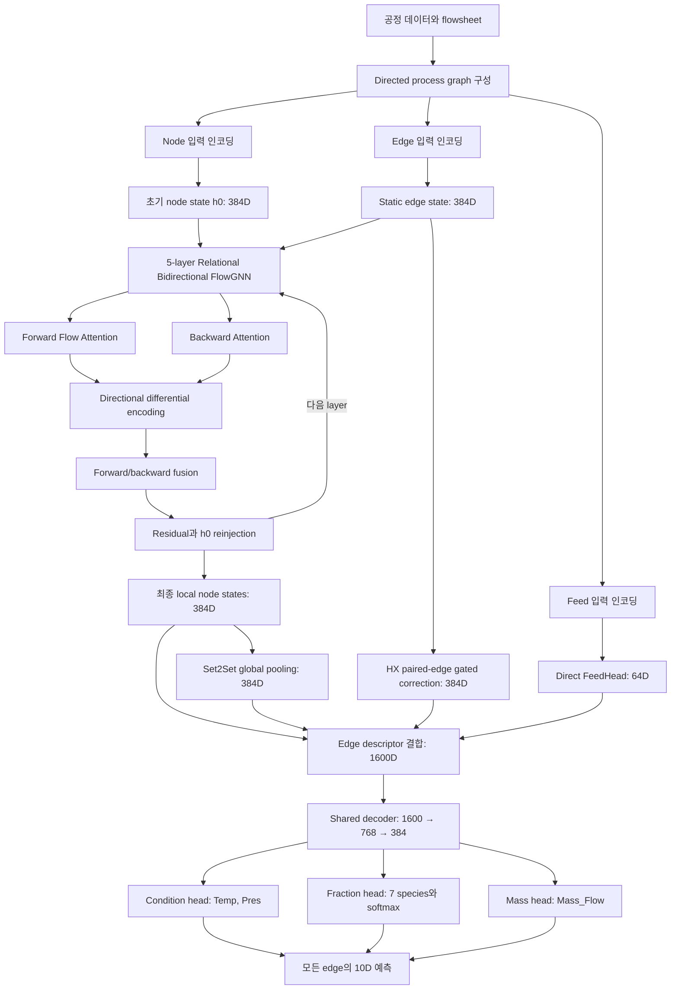
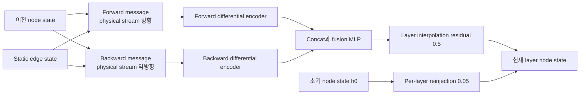
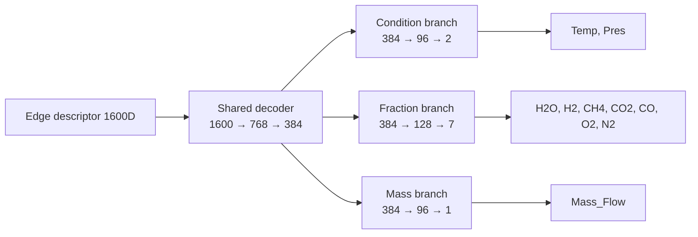
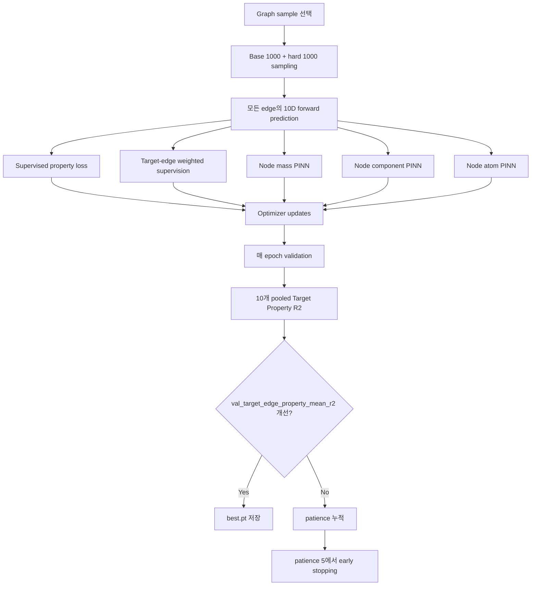
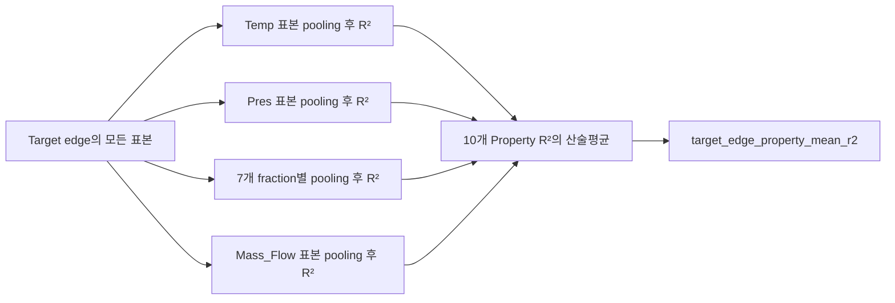
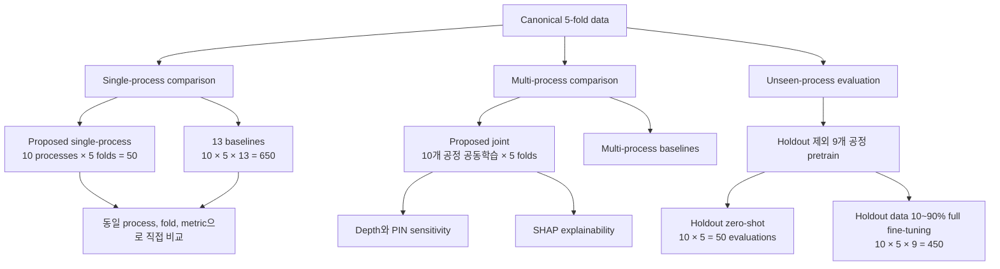

# Proposed 10D 모델 및 전체 실험 흐름도

이 문서는 현재 최종 설정인
`configs/experiment/pinn/model_260805_10d_frac1.yaml`을 기준으로 모델 내부 계산과
최종 실험 구성을 한 번에 확인하기 위한 요약 문서다.

## 1. 전체 모델 흐름



## 2. 입력 인코딩

### 2.1 Node 경로

```text
Node semantic role embedding   32D
Unit type embedding            24D
Operating values               18D
Operating masks                18D
Operating encoder          36 → 64D
-----------------------------------
Concatenation                  120D
Node encoder            120 → 384 → 384D
```

최종 초기 node representation은 `h0 = 384D`다. Operating mask를 값과 함께 넣으므로
실제 값이 0인 경우와 관측되지 않은 경우를 구분한다.

### 2.2 Edge 경로

```text
Stream semantic role embedding   24D
Stream identity embedding        32D
Structural attribute encoder     16D
------------------------------------
Concatenation                     72D
Edge encoder               72 → 384 → 384D
```

생성된 384D edge state는 GNN layer마다 새로 갱신하지 않는 static state다. 모든 layer의
message와 attention logit에 반복해서 들어가 stream identity를 유지한다.

### 2.3 Direct feed 경로

CH4, AIR, WATER 공급량과 각각의 관측 mask를 결합한다.

```text
3 feed values + 3 masks = 6D
FeedHead: 6 → 32 → 64D
```

이 경로는 message passing을 거치지 않고 최종 edge decoder에 직접 연결된다.

## 3. Bidirectional FlowGNN

각 layer에는 forward와 backward라는 독립적인 두 branch가 있다. 두 branch 모두 static edge
state를 사용하지만 message 방향과 파라미터는 서로 다르다.



### 3.1 Forward Flow Attention

Forward branch의 message는 원래 물리적 stream 방향으로 이동한다.

```text
source j ──→ destination i1
         ├─→ destination i2
         └─→ destination i3
```

Softmax는 receiver가 아니라 동일한 sender `j`에서 나가는 outgoing edge끼리 수행한다.

$$
\beta_{ij}
=
\frac{\exp(e_{ij})}
{\sum_{k\in\mathcal N_{\mathrm{out}}(j)}\exp(e_{kj})},
\qquad
\sum_{i\in\mathcal N_{\mathrm{out}}(j)}\beta_{ij}=1.
$$

즉, `j`가 자신의 message 또는 flow를 여러 destination으로 어떻게 분배할지를 표현한다.
Message passing 방향을 뒤집은 것이 아니라 softmax normalization 기준만 sender로 바꾼 것이다.

### 3.2 Backward Attention

Backward branch는 동일한 physical edge를 반대로 읽어 downstream의 상태와 recycle 영향을
upstream node로 전달한다. 역방향으로 들어오는 message들을 physical source node에서 모아
attention한다. 따라서 역방향 message 관점에서는 receiver가 어떤 downstream 정보를 받을지
결정하는 일반적인 incoming aggregation 역할을 한다.

### 3.3 Differential encoding과 skip connection

각 방향에서 aggregate 자체뿐 아니라 현재 node state와의 차이도 인코딩한다.

$$
\delta_i^{(\ell,q)}
=a_i^{(\ell,q)}-h_i^{(\ell-1)},
\qquad q\in\{\rightarrow,\leftarrow\}.
$$

Forward와 backward 결과를 fusion한 뒤 두 개의 skip 경로를 적용한다.

$$
\bar h_i^{(\ell)}
=h_i^{(\ell-1)}
+0.5\left(\widetilde h_i^{(\ell)}-h_i^{(\ell-1)}\right),
$$

$$
h_i^{(\ell)}=\bar h_i^{(\ell)}+0.05h_i^{(0)}.
$$

- `0.5` interpolation residual: 이전 layer state를 보존한다.
- `0.05` initial-state reinjection: 최초 role, unit, operating 정보를 매 layer 다시 넣는다.
- 이 계산을 총 5개 GNN layer에서 반복한다.

## 4. Global, HX 및 edge descriptor 경로

최종 node state에는 3-step Set2Set pooling을 적용해 graph 전체를 나타내는 384D global state를
만든다. HX edge에는 대응되는 hot/cold paired edge와 side embedding을 이용한 gated correction을
적용한다.

각 예측 edge `source → destination`의 descriptor는 다음 다섯 항목을 결합한다.

| 구성 요소 | 차원 |
|---|---:|
| Source node state | 384 |
| Destination node state | 384 |
| Global graph state | 384 |
| HX-corrected static edge state | 384 |
| Direct feed state | 64 |
| 합계 | **1600** |

따라서 시작 node뿐만 아니라 끝 node embedding도 최종 edge 예측에 직접 사용된다.

## 5. Shared decoder와 10D 출력

모든 공정과 모든 edge가 같은 decoder와 property head를 공유한다. Process ID에 따라 별도의
prediction head를 선택하지 않는다.



Fraction branch에는 temperature `0.5`인 softmax를 사용하므로 7개 mole fraction은 음수가 될
수 없고 합이 1이 된다. Mass_Flow는 scaled-log 좌표에서 예측한 후 물리 단위로 역변환한다.

최종 출력 순서는 다음과 같다.

```text
Temp
Pres
Frac_H2O
Frac_H2
Frac_CH4
Frac_CO2
Frac_CO
Frac_O2
Frac_N2
Mass_Flow
```

`Mole_Flow`, `Vol_Flow`, `Density`, `Enthalpy`는 현재 prediction head, loss 및 최종 metric에서
제외한다.

## 6. 학습 흐름



학습 objective, checkpoint monitor, 최종 test metric은 서로 구분한다.

- Backpropagation: supervised loss와 활성 PINN loss
- Checkpoint 선택: `val_target_edge_property_mean_r2` 최대값
- 최종 보고: best checkpoint의 `test_target_edge_property_mean_r2`

## 7. Target metric 흐름



이는 target edge별 R²를 먼저 구해 평균하는 방식이 아니다. 각 Property에 해당하는 모든 target
edge 표본을 하나의 pool로 합쳐 R²를 계산한 후, 10개 Property R²를 평균한다.

## 8. 전체 실험 구성



### 8.1 공정별 직접 비교

Proposed single-process와 13개 baseline은 같은 공정과 같은 fold의 train/validation/test 행을
사용한다. Proposed single-process는 다른 공정 데이터나 pretrained checkpoint를 사용하지 않고
각 fold에서 무작위 초기화 상태로 처음부터 학습한다.

```text
Proposed: 1 model × 10 processes × 5 folds = 50 runs
Baselines: 13 models × 10 processes × 5 folds = 650 runs
```

### 8.2 공동학습 비교

Proposed joint는 10개 공정을 하나의 shared model로 함께 학습한다. 이 결과는 multi-process
baseline과 비교하며, 공정별 from-scratch baseline과는 별도의 비교 축이다.

### 8.3 미관측 공정 일반화

각 holdout 공정마다 나머지 9개 공정으로 pretrain checkpoint를 만든다. Holdout 공정의 학습
데이터를 전혀 사용하지 않으면 zero-shot이고, train subset 10~90%를 사용해 전체 모델을
미세조정하면 data-efficiency transfer다.

## 9. 주요 산출물

| 실험 | 기본 저장 위치 |
|---|---|
| Proposed single-process | `outputs/0819final/proposed_single_process` |
| Single-process baselines | `outputs/0819final/baselines/single` |
| Proposed joint | `outputs/0819final/proposed_joint_10d_clean` |
| Unseen pretrain/zero-shot | `outputs/0819final/proposed_unseen` |
| Transfer data efficiency | `outputs/0819final/data_efficiency` |
| Sensitivity | `outputs/0819final/sensitivity_10d_clean` |
| SHAP | `outputs/0819final/explainability_shap` |

공정별 직접 비교 집계 파일은 다음 두 개다.

```text
outputs/0819final/summary/raw/single_process_comparison_by_fold.csv
outputs/0819final/summary/single_process_comparison_summary.csv
```

## 10. 한 줄 요약

```text
Node/edge/feed encoding
→ 5-layer bidirectional FlowGNN
→ local/global/HX/feed edge descriptor
→ shared hierarchical 10D decoder
→ supervised + PINN optimization
→ pooled Target Property R²로 checkpoint 선택과 최종 평가
```
